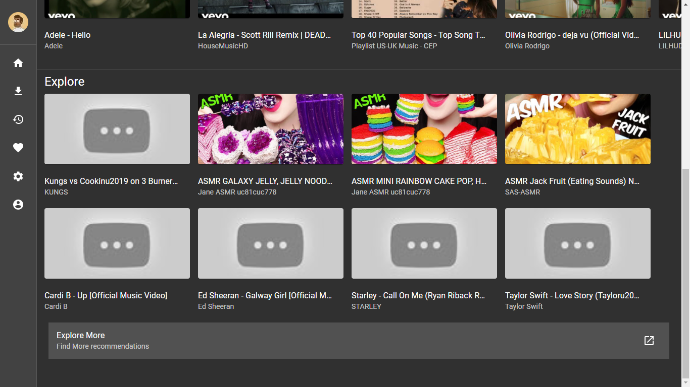

# Yebr Music Recommendation API
This Server uses tensorflow and scikit learn to serve recommednation models it mostly works as an internal microservice behind ```backend``` 

### How recommendations are served in the ui
Home Page

Explore Page


# Technical Usage will be out soon!

(c) 2021 Kabeer's Network
